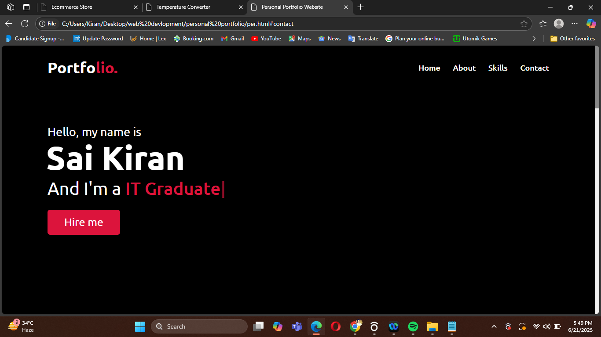

## 💼 Personal Portfolio Website

A simple and responsive personal portfolio website showcasing skills, contact info, and a downloadable resume. Built using HTML, CSS, and JavaScript.

---

### 🚀 Features

- Smooth scroll navigation  
- Typing animation using `typed.js`  
- Responsive design  
- Skills progress bars  
- Contact form UI  
- Scroll-up button  
- Clean UI/UX

---

### 🧰 Technologies Used

- HTML5  
- CSS3  
- JavaScript  
- jQuery  
- Font Awesome  
- Typed.js  
- Owl Carousel  

---

### 📸 Preview

---

### 📂 Folder Structure
/images/
├── saikiran.jpg
├── other images...
index.html
son.css
portfolio.js

---

### 📚 What I Learned

- How to build a responsive portfolio from scratch  
- CSS layouting and animations  
- DOM manipulation with JavaScript  
- Using libraries like Typed.js & Owl Carousel  
- Designing personal branding websites

---

### 📝 Credits

Inspired by a tutorial from [CodingNepal on YouTube](https://www.youtube.com/c/CodingNepal). Customized and extended as part of my personal web development learning journey.
